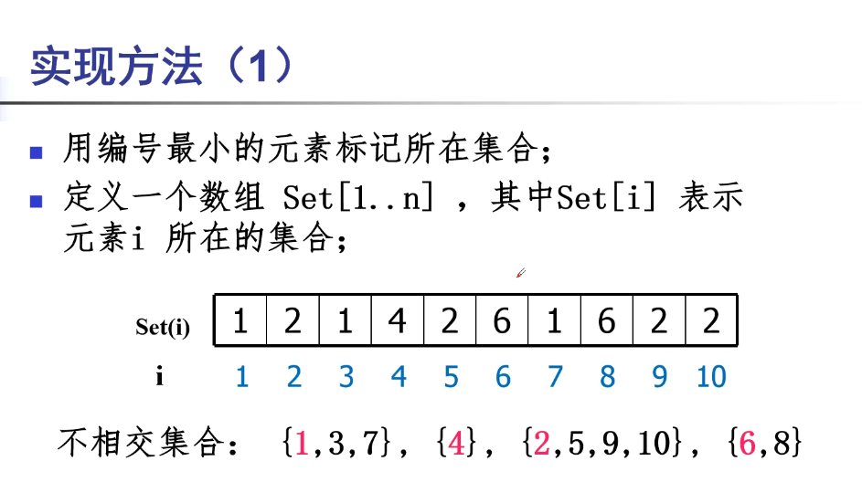
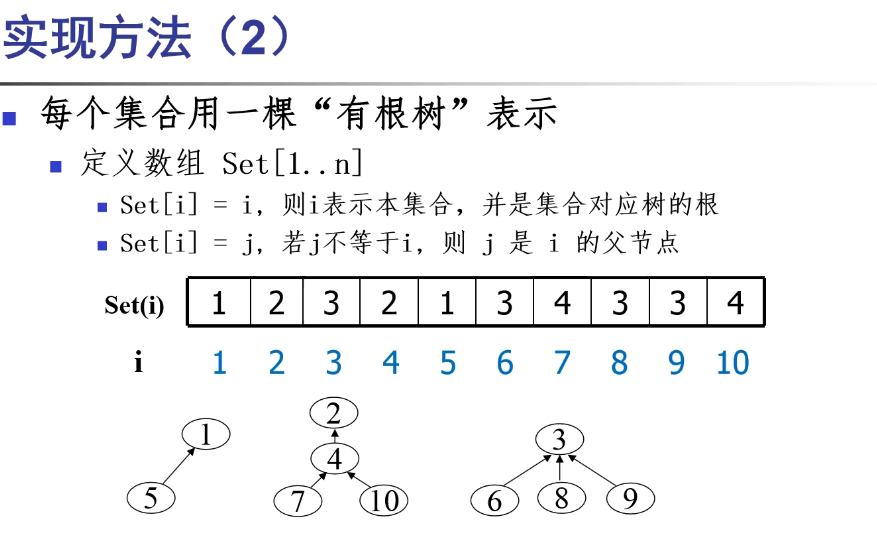

# 并查集

并查集（Disjoint Set Union，DSU）是一种用于管理元素所属集合的数据结构，实现为一个森林，其中每棵树表示一个集合，树中的节点表示对应集合中的元素。

**核心概念：**
- 英文名：Disjoint Set（不相交集合）
- 将编号 $1$ 到 $N$ 的元素划分为若干个互不相交的集合
- 每个集合选择某一元素作为代表（即根节点）

**两个核心操作：**
1. **合并（Union）**：合并两个集合
2. **查找（Find）**：查询某个元素属于哪个集合

**两种实现方式：**
1. 数组实现
2. 树形结构实现

---

## 一、数组实现

对象从 $1$ 到 $N$ 编号，设置数组 `set[i]` 表示 $i$ 所在的集合，每个集合用其中**最小的元素**来标记。



例：1、3、7 在同一集合，则 `set[1]=set[3]=set[7]=1`（用最小元素 1 标记整个集合）。

```cpp
// 查找：直接访问 set[i]，即可找到所属集合（用最小元素代表集合）
int find1(int x) {
    return set[x];
}

// 合并两个集合：注意始终使用集合中最小元素来表示集合
void Mergel(int a, int b) {
    int i = min(a, b);
    int j = max(a, b);
    for (int k = 1; k <= n; k++) {
        if (set[k] == j) {
            set[k] = i;
        }
    }
}
```

> **说明：** 数组实现简单直观，但合并操作时间复杂度为 $O(N)$，效率较低。

---

## 二、树形结构实现

每棵树用**有根树**来表示，用根节点代表整个集合。

**数组定义：** `set[i] = i` 表示 $i$ 指向自身，即 $i$ 是根节点（代表其集合）；`set[i] = j` 表示 $i$ 的父节点是 $j$。



```cpp
// 查找：沿父节点向上找到根节点
int find2(int x) {
    int r = x;
    while (r != set[r]) {
        r = set[r];
    }
    return r;
}

// 合并：注意这里的 a, b 都是两集合的根节点
void merge2(int a, int b) {
    set[a] = b;
}
```

> **说明：** 朴素树形实现在极端情况下（链状树）查找复杂度退化为 $O(N)$，需要优化。

---

## 三、优化实现：路径压缩 + 按秩合并

实际竞赛中常用两种优化手段，使得均摊时间复杂度接近 $O(\alpha(N))$（$\alpha$ 为反阿克曼函数，可视为常数）：

- **路径压缩（Path Compression）**：`find` 时将路径上所有节点直接指向根节点
- **按秩合并（Union by Rank）**：将深度较小的树合并到深度较大的树下，避免退化

```cpp
#include <bits/stdc++.h>
using namespace std;

struct DSU {
    vector<int> parent, rnk, sz;
    int components; // 连通分量数量

    // 初始化：n 个元素，编号 0 ~ n-1
    DSU(int n) : parent(n), rnk(n, 0), sz(n, 1), components(n) {
        iota(parent.begin(), parent.end(), 0); // parent[i] = i
    }

    // 查找根节点（路径压缩）
    int find(int x) {
        if (parent[x] != x)
            parent[x] = find(parent[x]); // 递归压缩路径
        return parent[x];
    }

    // 合并两个集合（按秩合并），返回是否成功合并
    bool unite(int x, int y) {
        x = find(x);
        y = find(y);
        if (x == y) return false; // 已在同一集合
        if (rnk[x] < rnk[y]) swap(x, y);
        parent[y] = x;            // 将 y 合并到 x 下
        sz[x] += sz[y];
        if (rnk[x] == rnk[y]) rnk[x]++;
        components--;
        return true;
    }

    // 查询两元素是否在同一集合
    bool same(int x, int y) {
        return find(x) == find(y);
    }

    // 查询元素 x 所在集合的大小
    int getSize(int x) {
        return sz[find(x)];
    }
};

int main() {
    int n = 6;
    DSU dsu(n);

    dsu.unite(0, 1);
    dsu.unite(1, 2);
    dsu.unite(3, 4);

    cout << dsu.same(0, 2) << "\n";  // 1 (true，0 和 2 同集合)
    cout << dsu.same(0, 3) << "\n";  // 0 (false，0 和 3 不同集合)
    cout << dsu.getSize(0) << "\n";  // 3 (集合 {0,1,2} 大小为 3)
    cout << dsu.components << "\n";  // 3 (共 3 个连通分量)
    return 0;
}
```

**复杂度分析：**

| 操作 | 朴素树形 | 路径压缩 + 按秩合并 |
|:---:|:---:|:---:|
| Find | $O(N)$ 最坏 | $O(\alpha(N))$ 均摊 |
| Union | $O(N)$ 最坏 | $O(\alpha(N))$ 均摊 |
| 空间 | $O(N)$ | $O(N)$ |

**典型应用场景：**
- 判断无向图的连通性
- Kruskal 最小生成树算法
- 判断图中是否存在环
- 动态连通性问题
